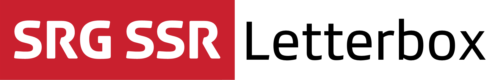

<p align="center"></p>

[](https://github.com/Carthage/Carthage)

## About

The SRG Letterbox library defines the official SRG SSR media player experience, packed into a single library, providing:

* A controller to play audios and videos, which supports on-demand, live and DVR streams.
* A service to manage application-wide playback. 
* A player view with the official SRG SSR look and feel, and supporting segment browsing and selection. The design is standard and cannot be altered. You can bind your own custom overlays to the default player controls, though.
* Access to all SRG SSR business unit medias.
* Native Airplay and picture in picture support.
* Seamless integration with the [SRG SSR analytics SDK](https://github.com/SRGSSR/srganalytics-ios) when used.

<p align="center"></p>

To ensure a coherent visual player identity throughout SRG SSR applications, **the design is intentionally not intended for customization**, and will follow future design evolutions. If you need a completely custom player, you should rather use the [SRG Media Player library](https://github.com/SRGSSR/SRGMediaPlayer-iOS) instead, on top of which Letterbox itself is implemented.

## Compatibility

The library is suitable for applications running on iOS 9 and above. The project is meant to be opened with the latest Xcode version (currently Xcode 8).

## Installation

The library can be added to a project using [Carthage](https://github.com/Carthage/Carthage)  by adding the following dependency to your `Cartfile`:
    
```
github "SRGSSR/srgletterbox-ios"
```

Then run `carthage update --platform iOS` to update the dependencies. You will need to manually add the following `.framework`s generated in the `Carthage/Build/iOS` folder to your project:

  * `ComScore`: The comScore framework
  * `FXReachability`: A reachability framework
  * `libextobjc`: A utility framework
  * `MAKVONotificationCenter`: A safe KVO framework
  * `Mantle`:  The framework used to parse the data
  * `Masonry`: An autolayout framework
  * `SRGAnalytics`: The main analytics framework
  * `SRGAnalytics_MediaPlayer`: The media player analytics companion framework
  * `SRGAnalytics_DataProvider`: The data provider analytics companion framework
  * `SRGAppearance`: The appearance framework
  * `SRGLogger`: The framework used for internal logging
  * `SRGMediaPlayer`: The media player framework (if not already in your project)
  * `YYWebImage`: A framework for image retrieval

For more information about Carthage and its use, refer to the [official documentation](https://github.com/Carthage/Carthage).

## Usage

When you want to use classes or functions provided by the library in your code, you must import it from your source files first.

### Usage from Objective-C source files

Import the global header file using:

```objective-c
#import <SRGLetterbox/SRGLetterbox.h>
```

or directly import the module itself:

```objective-c
@import SRGLetterbox;
```

### Usage from Swift source files

Import the module where needed:

```swift
import SRGLetterbox
```

### Working with the library

To learn about how the library can be used, have a look at the [getting started guide](Documentation/Getting-started.md).

### Logging

The library internally uses the [SRG Logger](https://github.com/SRGSSR/srglogger-ios) library for logging, within the `ch.srgssr.letterbox` subsystem. This logger either automatically integrates with your own logger, or can be easily integrated with it. Refer to the SRG Logger documentation for more information.

### Control preview in Interface Builder

Interface Builder can render custom controls dropped onto a storyboard or a xib. If you want to enable this feature for Letterbox controls, and after Carthage has been run, open the `Carthage/Checkouts/srgletterbox-ios/Designables` directory, **copy** the `SRGLetterboxDesignables.m` file it contains to your project and add it to your target.

When dropping a view (e.g. `SRGLetterboxView`) onto a storyboard or xib, Xcode will now build your project in the background and render the view when it is done.

If rendering does not work properly:

* Be sure that your project correctly compiles
* If you still get `dlopen` errors, this means some frameworks are not available to Xcode when it runs your project for rendering. This usually means that the `copy-frameworks` build phase described in the [Carthage readme](https://github.com/Carthage/Carthage#getting-started) has not been setup properly. Be sure that all SRG Media Player dependencies are properly copied (see above framework list).

## Demo project

To test what the library is capable of, try running the associated demo by opening the workspace and building the associated scheme. You must perform both following commands from the root directory, as well as from the `Demo` folder:

```
carthage bootstrap --platform iOS
```

This will update all framework dependencies required to run the demo project.

## Known issues

Control center and lock screen integrations are not working reliably in the iOS simulator. This is a known simulator-only limitation, everything works fine on a device. 

## License

See the [LICENSE](LICENSE) file for more information.
