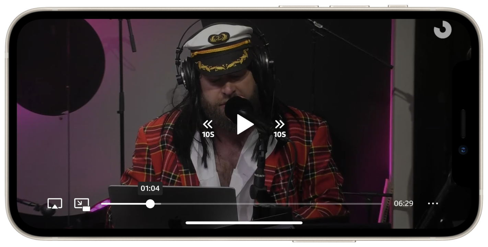

[](https://github.com/SRGSSR/srgletterbox-apple)

[](https://github.com/SRGSSR/srgletterbox-apple/releases) [](https://github.com/SRGSSR/srgletterbox-apple) [](https://swift.org/package-manager) [](https://github.com/SRGSSR/srgletterbox-apple/blob/master/LICENSE) 

## About

The SRG Letterbox library defines the official SRG SSR media player experience, packed into a single library providing:

* A controller to play audios and videos, which supports on-demand, live and DVR streams.
* A service to manage application-wide playback (iOS).
* A responsive player view with the official SRG SSR look and feel (iOS).
* A standard `AVPlayerViewController`-based player for straightforward integration (tvOS).
* Support for 360° videos (iOS).
* CarPlay support (iOS).
* Support for chapter and segment browsing and selection. 
* Playlist support.
* Access to all SRG SSR business unit medias.
* Native AirPlay and picture in picture support (iOS)
* Seamless integration with the [SRG SSR analytics SDK](https://github.com/SRGSSR/srganalytics-apple) when used.
* ... and [a lot more](FEATURES.md).

<p align="center"></p>

To ensure a coherent visual player identity throughout SRG SSR applications, **the design is intentionally not intended for customization**, and will follow future design evolutions. If you need a completely custom player, you should rather use the [SRG Media Player library](https://github.com/SRGSSR/srgmediaplayer-apple) instead, on top of which Letterbox itself is implemented.

## Compatibility

The library is suitable for applications running on iOS 12, tvOS 12 and above. The project is meant to be compiled with the latest Xcode version.

## Contributing

If you want to contribute to the project, have a look at our [contributing guide](CONTRIBUTING.md).

## Recommended tools

Building the `SRGLetterbox-demo` target requires command-line tools for icon generation, easily installed with [Homebrew](https://brew.sh/):

	brew install imagemagick ghostscript
	brew install jq

## Integration

The library must be integrated using [Swift Package Manager](https://swift.org/package-manager) directly [within Xcode](https://developer.apple.com/documentation/xcode/adding_package_dependencies_to_your_app). You can also declare the library as a dependency of another one directly in the associated `Package.swift` manifest.

## Usage

When you want to use classes or functions provided by the library in your code, you must import it from your source files first. In Objective-C:

```objective-c
@import SRGLetterbox;
```

or in Swift:

```swift
import SRGLetterbox
```

### Working with the library

To learn about how the library can be used, have a look at the [getting started guide](GETTING_STARTED.md).

### Logging

The library internally uses the [SRG Logger](https://github.com/SRGSSR/srglogger-apple) library for logging, within the `ch.srgssr.letterbox` subsystem. This logger either automatically integrates with your own logger, or can be easily integrated with it. Refer to the SRG Logger documentation for more information.

## App Privacy details on the App Store

You are required to provide additional information about the data collected by your app and how it is used. Please refer to our [associated documentation](https://github.com/SRGSSR/srgletterbox-apple/wiki/App-Privacy-details-on-the-App-Store) for more information.

## Demo project

To test what the library is capable of, run the associated demo. Before running it, you should initialize the project by calling `make setup` (or `make public.setup` if you are not part of the SRG SSR organization) from the main repository directory.

#### URL schemes (iOS)

The iOS demo application can be opened with a custom URL scheme having the following format: `letterbox(-nightly|-debug)`.

* Open a media within the player: `[scheme]://open?media=[media_urn]`.
* A `&server=[server_name]` parameter can be added to force a server selection. The available server list can be found in the _Server_ section of the application settings.

## Settings

Private project settings (keys, tokens, etc.) are stored [in a private repository](https://github.com/SRGSSR/srgletterbox-apple-configuration), pulled under the `Configuration` directory when running `make setup` (or any other target depending on it). The SHA-1 of the configuration commit which is used is explicitly provided in the `Makefile`. Settings are therefore versioned alongside the project, providing for reproducible builds.

If you need to make changes to the settings:

1. Perform the required changes in the `Configuration` directory (and in the project as well if needed).
1. Switch to the `Configuration` directory and commit changes there.
1. Update the [Makefile](../Makefile) `CONFIGURATION_COMMIT_SHA1` variable to point at the configuration commit to use.
1. Push all commits when you are ready.

## Migration between major versions

For more information about migrating between major Letterbox versions, please check the corresponding release notes as well as our [migration guides](https://github.com/SRGSSR/srgletterbox-apple/wiki/Migration-guides).

## Known issues

Control center and lock screen integrations are not working reliably in the iOS simulator. This is a known simulator-only limitation, everything works fine on a device. 

Moreover, standard view controller transitions (e.g. screen edge pan in a navigation controller), more generally those based on `UIPercentDrivenInteractiveTransition`, will interfere with playback, since they alter layer speeds (and thus `AVPlayerLayer` speed). For a perfect result you should therefore implement your own transition animator. An example is supplied with the demo.

## Standard system behaviors

If playback is paused from the iOS application and the device is locked afterwards, the lock screen will surprisingly not display playback controls. This is standard behavior (Apple Podcasts application works the same). Playback can be restarted from the control center, though.

Moreover, video playback is paused by the system automatically when putting the application in the background, except when picture in picture is used.

## License

See the [LICENSE](../LICENSE) file for more information.
