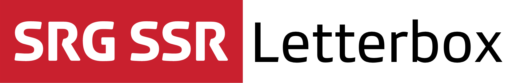
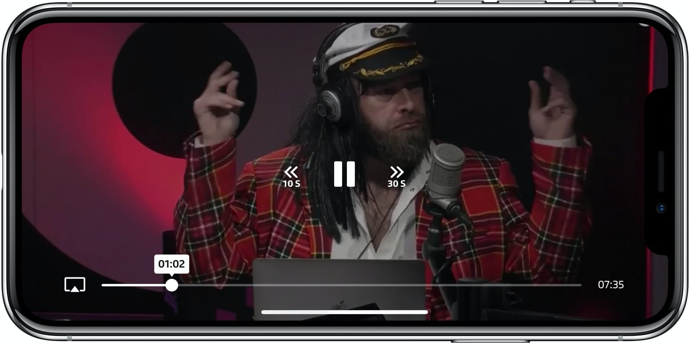

<p align="center"></p>

[](https://github.com/Carthage/Carthage)

## About

The SRG Letterbox library defines the official SRG SSR media player experience, packed into a single library, providing:

* A controller to play audios and videos, which supports on-demand, live and DVR streams.
* A service to manage application-wide playback. 
* A responsive player view with the official SRG SSR look and feel.
* Support for 360° videos.
* Support for chapter and segment browsing and selection. 
* Playlist support.
* Access to all SRG SSR business unit medias.
* Native AirPlay and picture in picture support.
* Seamless integration with the [SRG SSR analytics SDK](https://github.com/SRGSSR/srganalytics-ios) when used.

<p align="center"></p>

To ensure a coherent visual player identity throughout SRG SSR applications, **the design is intentionally not intended for customization**, and will follow future design evolutions. If you need a completely custom player, you should rather use the [SRG Media Player library](https://github.com/SRGSSR/SRGMediaPlayer-iOS) instead, on top of which Letterbox itself is implemented.

## Compatibility

The library is suitable for applications running on iOS 9 and above. The project is meant to be opened with the latest Xcode version (currently Xcode 9).

## Installation

The library can be added to a project using [Carthage](https://github.com/Carthage/Carthage) by adding the following dependency to your `Cartfile`:
    
```
github "SRGSSR/srgletterbox-ios"
```

If you have access to it, be sure to also add [SRG Content Protection](github "SRGSSR/srgcontentprotection-ios") dependency so that you can play all kinds of streams:

```
github "SRGSSR/srgcontentprotection-ios"
```

Until Carthage 0.30, only dynamic frameworks could be integrated. Starting with Carthage 0.30, though, frameworks can be integrated statically as well, which avoids slow application startups usually associated with the use of too many dynamic frameworks.

For more information about Carthage and its use, refer to the [official documentation](https://github.com/Carthage/Carthage).

### Dependencies

The library requires the following frameworks to be added to any target requiring it:

* `ComScore`: The comScore framework.
* `FXReachability`: A reachability framework.
* `libextobjc`: A utility framework.
* `MAKVONotificationCenter`: A safe KVO framework.
* `Mantle`:  The framework used to parse the data.
* `Masonry`: An autolayout framework.
* `SRGAnalytics`: The main analytics framework.
* `SRGAnalytics_MediaPlayer`: The media player analytics companion framework.
* `SRGAnalytics_DataProvider`: The data provider analytics companion framework.
* `SRGAppearance`: The appearance framework.
* `SRGLetterbox`: The Letterbox library framework.
* `SRGLogger`: The framework used for internal logging.
* `SRGMediaPlayer`: The media player framework (if not already in your project).
* `SRGNetworking`: A networking framework.
* `YYWebImage`: A framework for image retrieval.

If you added SRG Content Protection as dependency, be sure to add `SRGContentProtection` as well.

### Dynamic framework integration

1. Run `carthage update` to update the dependencies (which is equivalent to `carthage update --configuration Release`). 
2. Add the frameworks listed above and generated in the `Carthage/Build/iOS` folder to your target _Embedded binaries_.

If your target is building an application, a few more steps are required:

1. Add a _Run script_ build phase to your target, with `/usr/local/bin/carthage copy-frameworks` as command.
2. Add each of the required frameworks above as input file `$(SRCROOT)/Carthage/Build/iOS/FrameworkName.framework`.

### Static framework integration

1. Run `carthage update --configuration Release-static` to update the dependencies. 
2. Add the frameworks listed above and generated in the `Carthage/Build/iOS/Static` folder to the _Linked frameworks and libraries_ list of your target.
3. Also add any resource bundle `.bundle` found within the `.framework` folders to your target directly.
4. Some non-statically built framework dependencies are built in the `Carthage/Build/iOS` folder. Add them by following the _Dynamic framework integration_ instructions above.
5. Add the `-all_load` flag to your target _Other linker flags_.

## Building the project

A [Makefile](../Makefile) provides several targets to build and package the library. The available targets can be listed by running the following command from the project root folder:

```
make help
```

Alternatively, you can of course open the project with Xcode and use the available schemes.

Private project settings (keys, tokens, etc.) are stored [in a private repository](https://github.com/SRGSSR/playsrg-configuration-ios), pulled under the `Configuration` directory when running `make setup` (or any other target depending on it). The SHA-1 of the configuration commit which is used is explicitly provided in the `Makefile`. Settings are therefore versioned alongside the project, providing for reproducible builds.

If you need to make changes to the settings:

1. Perform the required changes in the `Configuration` directory (and in the project as well if needed).
1. Switch to the `Configuration` directory and commit changes there.
1. Update the [Makefile](../Makefile) `CONFIGURATION_COMMIT_SHA1` variable to point at the configuration commit to use.
1. Push all commits when you are ready.

## Usage

When you want to use classes or functions provided by the library in your code, you must import it from your source files first.

### Usage from Objective-C source files

Import the global header file using:

```objective-c
#import <SRGLetterbox/SRGLetterbox.h>
```

or directly import the module itself:

```objective-c
@import SRGLetterbox;
```

### Usage from Swift source files

Import the module where needed:

```swift
import SRGLetterbox
```

### Working with the library

To learn about how the library can be used, have a look at the [getting started guide](Getting-started.md).

### Logging

The library internally uses the [SRG Logger](https://github.com/SRGSSR/srglogger-ios) library for logging, within the `ch.srgssr.letterbox` subsystem. This logger either automatically integrates with your own logger, or can be easily integrated with it. Refer to the SRG Logger documentation for more information.

### Control preview in Interface Builder

Interface Builder can render custom controls dropped onto a storyboard or a xib. If you want to enable this feature for Letterbox controls, and after Carthage has been run, open the `Carthage/Checkouts/srgletterbox-ios/Designables` directory, **copy** the `SRGLetterboxDesignables.m` file it contains to your project and add it to your target.

When dropping a view (e.g. `SRGLetterboxView`) onto a storyboard or xib, Xcode will now build your project in the background and render the view when it is done.

If rendering does not work properly:

* Be sure that your project correctly compiles
* If you still get `dlopen` errors, this means some frameworks are not available to Xcode when it runs your project for rendering. This usually means that the `copy-frameworks` build phase described in the [Carthage readme](https://github.com/Carthage/Carthage#getting-started) has not been setup properly. Be sure that all SRG Media Player dependencies are properly copied (see above framework list).

## Demo project

To test what the library is capable of, run the associated demo.

## Content protection

Your project must link against [SRG Content Protection](https://github.com/SRGSSR/srgcontentprotection-ios) to be able to play some content, including livestreams or TV series.

If some content is protected and SRG Content Protection has not been correctly linked, playback will either fail or remain stuck in a loading state.

## Known issues

Control center and lock screen integrations are not working reliably in the iOS simulator. This is a known simulator-only limitation, everything works fine on a device. 

Moreover, standard view controller transitions (e.g. screen edge pan in a navigation controller), more generally those based on `UIPercentDrivenInteractiveTransition`, will interfere with playback, since they alter layer speeds (and thus `AVPlayerLayer` speed). For a perfect result you should therefore implement your own transition animator. An example is supplied with the demo.

## Standard system behaviors

If playback is paused from the application and the device is locked afterwards, the lock screen will surprisingly not display playback controls. This is standard iOS behavior (Apple Podcasts application works the same). Playback can be restarted from the control center, though.

Moreover, video playback is paused by the system automatically when putting the application in the background, except when picture in picture is used.

## License

See the [LICENSE](../LICENSE) file for more information.
